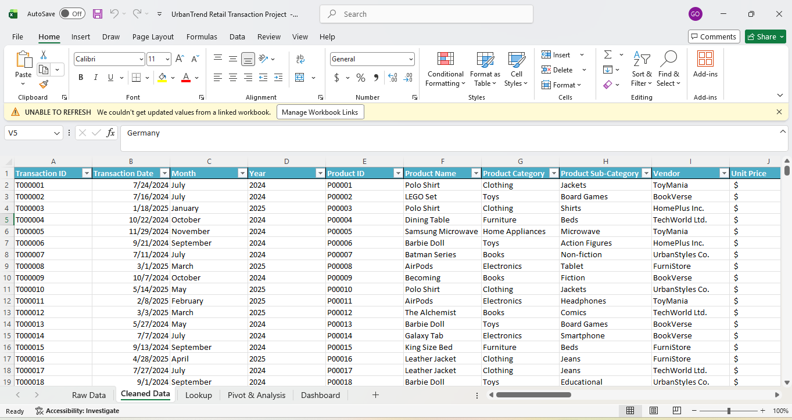
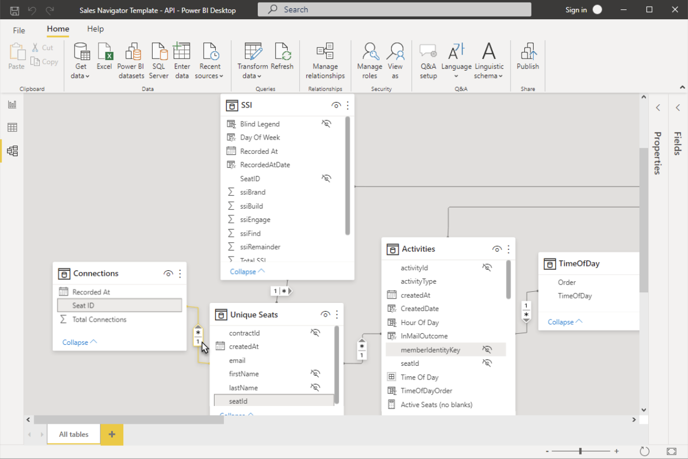
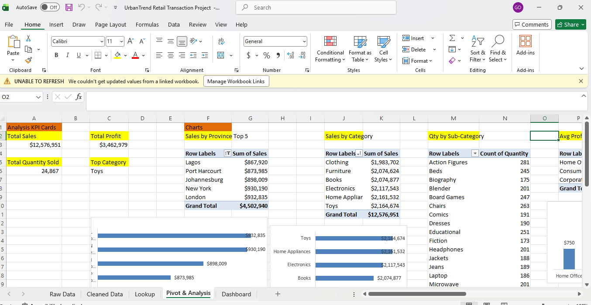
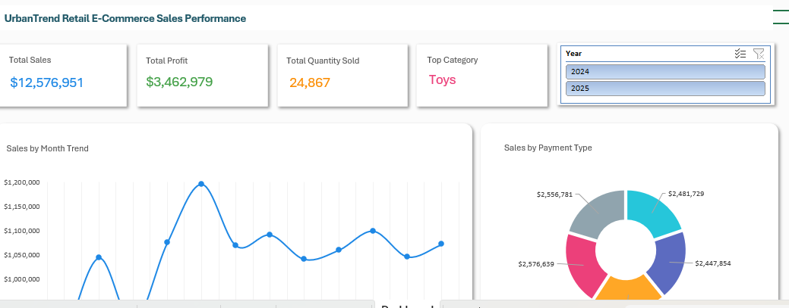

# E-Commerce-Sales-Performance-Dashboard

## Introduction
Urban Trend Retail USA is a fast-growing e-commerce company specializing in consumer goods across major U.S. cities. As competition in online retail continues to intensify, the company needs better visibility into its sales performance, customer behaviour and profitability. This project focuses on analysing **_two years of transactional data_** to create an interactive Power BI dashboard that supports strategic decision-making for sales, marketing and operations teams.

## Problem Statement
UrbanTrend’s leadership team lacked a centralized view of performance metrics such as total sales, profit, product performance, and regional trends. Reporting was fragmented across spreadsheets, making it difficult to quickly identify opportunities and risks. The goal of this project was to design a single, user-friendly dashboard that answers key business questions and enables stakeholders to track performance at a glance.

## Data Sourcing
The dataset used for this project is a fictional UrbanTrend Retail Transaction Dataset, designed to simulate real-world e-commerce operations.
1. **Source:** Internal sales transaction system (simulated)
2. **Time Period:** May 2024 – May 2025
3. **Records:** 4,501 transactions
4. **Key Fields:**
  - Transaction Date
  - Order ID
  - Product Name & Category
  - City
  - Quantity
  - Sales Amount
  - Discount Applied
  - Cost & Profit
  - Payment Method

## Data Transformation & Cleaning
1. Before analysis, the raw data was prepared in Power Query to ensure accuracy and consistency:
2. Created a backup copy of the original dataset
3. Removed duplicate transactions
4. Standardized date formats and column naming conventions
5. Corrected inconsistent product category labels
6. Replaced missing values in Discount Applied with zero
7. Created new calculated columns for:
  - Net Sales After Discount
  - Profit
  - Profit Margin

**_View the Cleaned Dataset below:_**

## Data Modeling (Power BI)
A star schema model was built in Power BI to support efficient analysis and performance:

**Fact Table:**
  - FactSales (transactions, sales amount, quantity, profit)
    
**Dimension Tables:**
 - DimDate
 - DimProduct
 - DimCity
 - DimCustomer
 - DimPaymentMethod

**Relationships:**
 - One-to-many relationships from each dimension to the FactSales table
 - Date table marked as the official date table

This model structure allows flexible slicing and filtering across all visuals.

**_View the Data Modelling below:_**

##  Analysis & Measures
Key DAX measures were created to track performance:

- **Total Sales**

    Total Sales = SUM(FactSales[SalesAmount])
  
- **Total Profit**

    Total Profit = SUM(FactSales[Profit])
  
- **Total Units Sold**

    Total Units = SUM(FactSales[Quantity])
  
- **Profit Margin**

    Profit Margin = DIVIDE([Total Profit], [Total Sales])
  
- **Average Discount**

    Avg Discount = AVERAGE(FactSales[DiscountApplied])

  **_View the Pivot table below:_**
  

## Dashboard & Visuals
Dashboard screenshots are placed here in the portfolio.

The dashboard includes:
- **KPI Cards:**
   - Total Sales
   - Total Profit
   - Total Units Sold
   - Profit Margin
     
- **Line Chart:** Monthly Sales Trend
  
- **Bar Chart:** Sales by Product Category
  
- **Column Chart:** Sales by City
  
- **Donut Chart:** Payment Method Distribution
  
- **Slicers:**
   - Year
   - Product Category
   - City
   - Payment Method
     
The layout is designed for fast executive review and interactive exploration

  **_View the Dashboard below:_**

  

## Insights & Findings
 - Total Sales: $12,576,951
 - Total Profit: $3,462,979
 - Total Units Sold: 24,867
 - The Toys category generated the highest revenue, outperforming all other categories.
 - Sales consistently dip in March, followed by a strong peak in May, suggesting seasonal demand patterns.
 - Credit Card is the most used payment method, followed by PayPal.
 - Top-performing cities are New York, Los Angeles, and Chicago, highlighting the importance of major urban markets.

## Recommendations
 - Increase marketing investment and promotions in April–May to capitalize on peak demand.
 - Investigate the cause of low March sales and test targeted campaigns or bundles.
 - Expand and prioritize inventory for the Toys category.
 - Optimize checkout and loyalty programs for credit card users.
 - Develop localized campaigns for top-performing cities.

## Conclusion
This project delivered a centralized, interactive Power BI dashboard that gives UrbanTrend leadership a clear and actionable view of business performance. By combining clean data, a strong data model and intuitive visuals, the dashboard enables faster decision-making around sales strategy, product planning and regional marketing. Future improvements could include customer lifetime value analysis and deeper segmentation.

